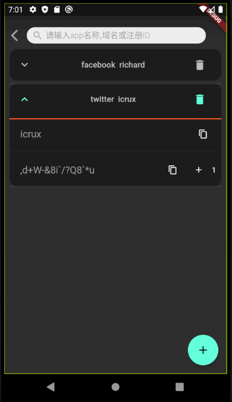

# passkeep

*将密码存储在本地的密码生成及管理工具*

## 登录

- 如果用户名之前不存在,则直接创建新用户
- 如果用户存在,则需要核对用户名密码才能登陆成功
- 注意:
  - 之后用户用于其他网站和应用的密码会通过登录时输入的用户名和密码算出
  - 登录时使用的用户名和密码请务必记清楚,这是您能在其他设备上恢复被管理的密码的基础
- 当用户名存在时,输入正确的密码,长安登录按钮将删除该账户的所有信息

## 登录后
如果之前没有任何被管理的密码信息, 默认出添加网站密码的界面

**注意**:
用户用于登录的用户名和密码以及此页面的"app或网站信息","用户ID"是您在其他设备上使用恢复被管理的密码的关键信息

否则出密码管理界面,右边为删除密码按钮, 右下角为添加新密码的按钮

展开后,可以查看,复制密码及复制用户名

密码可以通过 '+' 号迭代,(迭代次数也是您在其他设备上恢复密码的关键信息)

### 搜索
可以输入被管理的网站或app的信息或用户名来搜索密码

